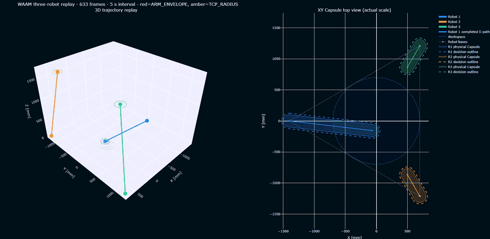
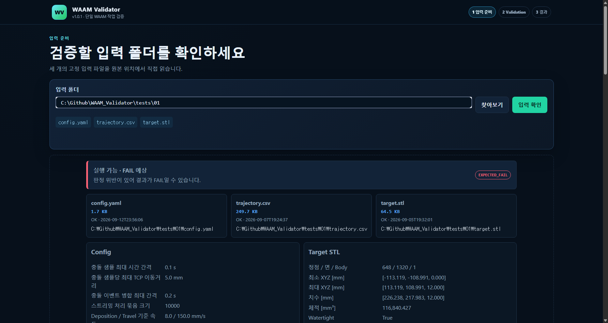
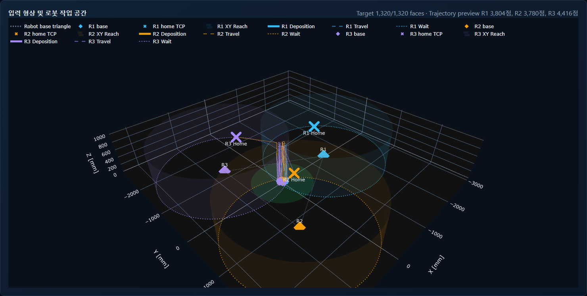
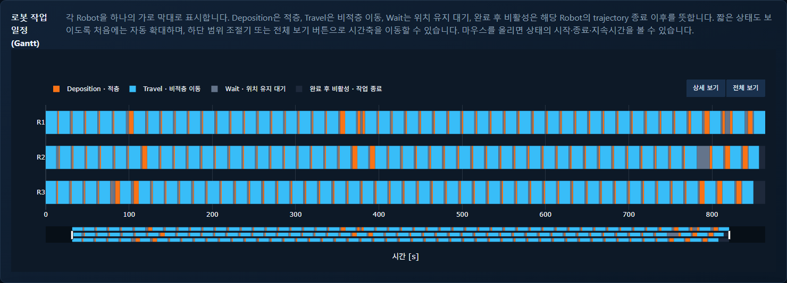
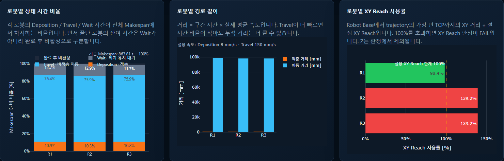
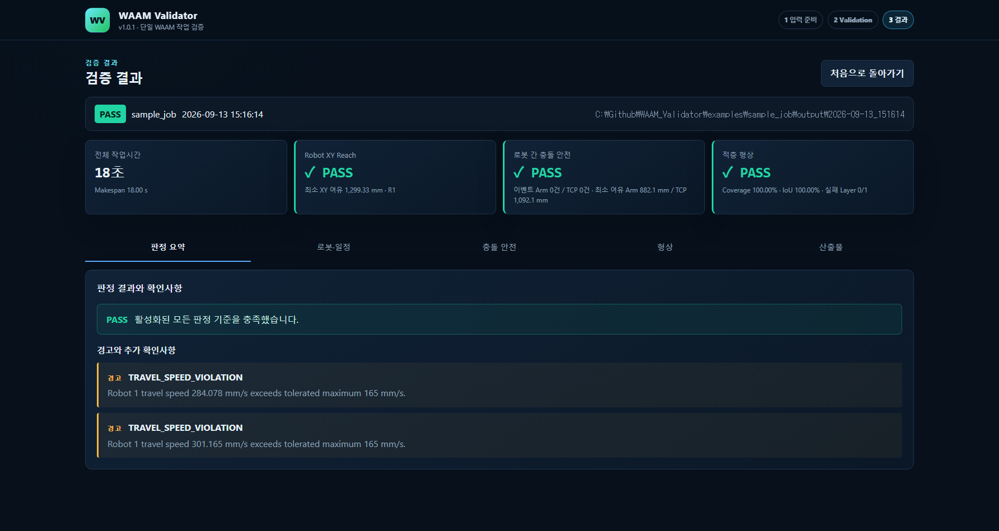
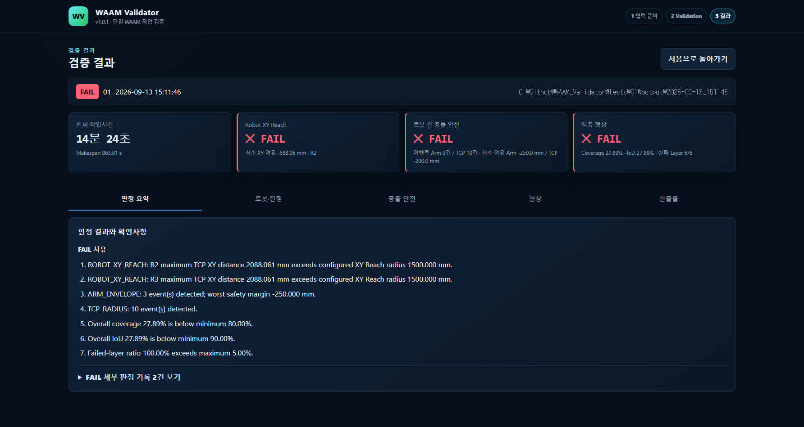
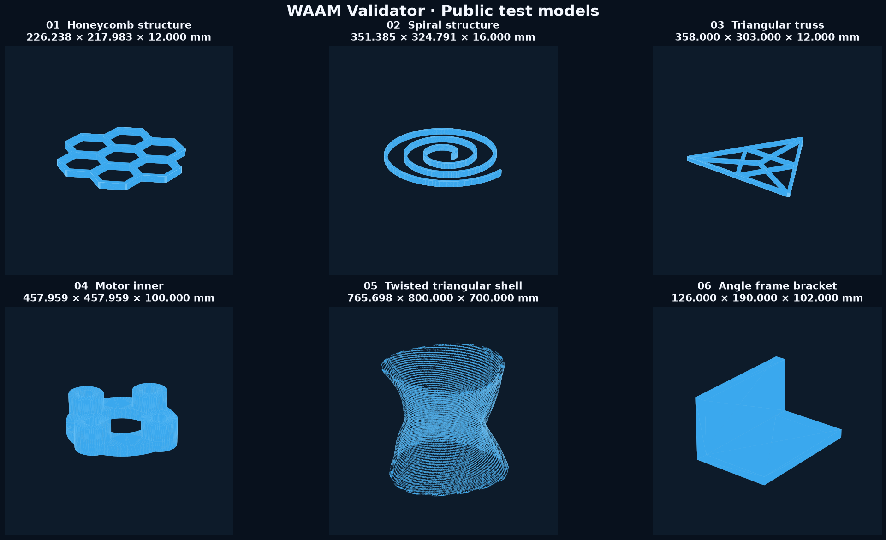

# WAAM Validator (v1.0.1)

[](LICENSE)
[](https://www.python.org/)

WAAM Validator는 세 대 로봇의 WAAM(DED) 작업 계획을 실행 전에 검증하는 Python
3.11+ 도구입니다. 하나의 작업 폴더에서 `config.yaml`, `trajectory.csv`,
`target.stl`을 읽고 다음을 계산합니다.



- 원본 trajectory interval 기준 일정, 상태별 시간·거리·평균속도
- Robot Base 기준 XY 평면 Reach 위반
- Base–TCP 중심선을 폭이 있는 Capsule로 본 XY Arm Envelope 충돌과 TCP 반경 침범
- 명목 비드 형상과 Target STL layer 단면의 Coverage, Underfill, Overfill, IoU

현재 애플리케이션 버전은 `1.0.1`, 결과 JSON schema는 `4.0`입니다. Config 자체에는
버전 필드가 없습니다.

> 이 도구는 계획 단계의 기하 검증기입니다. 실제 관절·링크 자세, Z 방향 로봇 간
> 회피, 지그·환경물, 열·용융풀·응력, 장1비 운전 안전은 모델링하지 않습니다.

## v1.0.1 변경 사항

- 기본 셀에서 Robot 2를 `+Y`, Robot 3을 `-Y` 방향에 배치하도록 Robot ID와 좌표의
  대응 관계를 정리했습니다.
- 기본 셀의 세 Robot 모두에 XY Reach 반경 `1,500 mm`를 적용했습니다.
- 결과 JSON schema는 기존 `4.0`을 유지합니다.

## 빠른 시작

Windows PowerShell 기준:

```powershell
cd C:\Github\WAAM_Validator
py -3.11 -m venv .venv
.\.venv\Scripts\Activate.ps1
python -m pip install -r requirements.lock
python -m pip install -e . --no-deps
```

입력 폴더는 정확히 다음 세 파일을 포함해야 합니다.

```text
my_job/
├── config.yaml
├── trajectory.csv
└── target.stl
```

```powershell
# 빠른 입력 검사
waam-validator check .\my_job

# 전체 Validation
waam-validator run .\my_job

# 로컬 UI
waam-validator ui .\my_job
```

UI는 `입력 준비 → Validation 진행 → 결과` 순서로 한 작업을 끝까지 처리합니다.
브라우저는 기본적으로 `http://127.0.0.1:8050`에서 열립니다.

## 애플리케이션 화면

입력 폴더를 확인하면 세 파일의 상태와 사전검사 결과가 나타납니다. 이어서 Target,
Robot Base·Home, XY Reach와 전체 trajectory를 한 좌표계에서 확인할 수 있습니다.





로봇별 Gantt는 Deposition·Travel·Wait·완료 후 비활성을 실제 시간축에 표시합니다.
같은 입력에서 상태 시간 비율, 경로 길이와 XY Reach 사용률도 함께 확인합니다.

| 로봇 작업 일정 | Trajectory 통계 |
| --- | --- |
|  |  |

Validation이 끝나면 최종 상태와 검사별 PASS/FAIL, 경고·실패 원인 및 세부 결과를
한 화면에서 확인할 수 있습니다.

| PASS 결과 | FAIL 결과와 실패 원인 |
| --- | --- |
|  |  |

## 입력 핵심 규칙

Trajectory 헤더는 정확히 아래와 같아야 합니다.

```csv
robot_id,time_s,x_mm,y_mm,z_mm,mode
```

`robot_id`는 `1`, `2`, `3`을 모두 포함합니다. 좌표와 STL은 같은 World 좌표계의
밀리미터 단위입니다. 각 행의 `mode`는 해당 행부터 다음 행까지의 상태입니다.
XY Reach는 `sqrt((TCP_x-Base_x)^2 + (TCP_y-Base_y)^2)`로 판정하며 TCP와 Base의
Z 좌표는 Reach 계산에 사용하지 않습니다.

| 값 | 전체 이름 | 의미 |
| --- | --- | --- |
| `D` | Deposition | 재료를 적층하며 이동 |
| `T` | Travel | 적층 없이 이동 |
| `W` | Wait | 허용 오차 안에서 위치를 유지 |

정확한 생성 계약은 [입력물 인터페이스](docs/WAAM_Validator_입력물_인터페이스.md),
모든 설정값은 [Config 참조](docs/config-reference.md)를 확인하십시오.

## 공개 테스트 모델

저장소의 `tests/01–06`에는 서로 다른 경로·레이어·형상 특성을 가진 공개 검토용
`config.yaml`과 `target.stl`이 포함됩니다. 아래 치수는 각 STL의 World XYZ 축에
정렬된 bounding box 크기이며 단위는 mm입니다.



| 폴더 | 형상 | X × Y × Z [mm] |
| --- | --- | ---: |
| `tests/01` | Honeycomb 구조 | 226.238 × 217.983 × 12 |
| `tests/02` | Spiral 구조 | 351.385 × 324.791 × 16 |
| `tests/03` | Triangular truss | 358 × 303 × 12 |
| `tests/04` | Motor inner | 457.959 × 457.959 × 100 |
| `tests/05` | Twisted triangular shell | 765.698 × 800 × 700 |
| `tests/06` | Angle frame bracket | 126 × 190 × 102 |

이 모델들은 형상 다양성에 대한 입력·전처리·검증 동작을 확인하기 위한 예제입니다.
특정 장비에서의 실제 제작 가능성이나 공정 품질을 보증하는 인증 데이터는 아닙니다.

## 결과

기본 실행은 매번 `my_job/output/YYYY-MM-DD_HHMMSS/`에 다음 핵심 파일만 생성합니다.

| 파일 | 내용 |
| --- | --- |
| `summary.json` | schema 4.0 최종 판정, 핵심 지표, 구조화된 issues |
| `validation_report.md` | 사람이 읽는 결과 보고서 |
| `robot_metrics.csv` | 상태 시간, 완료 후 비활성, 거리·속도·XY Reach |
| `collision_events.csv` | 충돌 종류·pair·시간·거리·안전 여유 |
| `layer_metrics.csv` | layer별 면적과 형상 지표 |
| `run.log` | 실행 단계와 계산 요약 |
| `validation_inputs.json` | 세 입력 파일의 SHA-256 지문과 Validation 당시 Config |

정적 PNG는 만들지 않습니다. `deposited.stl`과 self-contained `replay.html`은
Validation 결과 화면에서 예상 시간·용량을 확인한 뒤 필요한 것만 생성합니다. 생성
중 상태 파일은 결과 목록에 노출되지 않는 `.waam_state/`에 저장됩니다.

정상적인 판정 불합격은 `FAIL`이며 계산 결과를 모두 저장합니다. 입력·형상 파싱 또는
계산 자체를 완료할 수 없을 때만 `ERROR`입니다. 종료 코드는 PASS `0`, FAIL `1`,
입력 `2`, Target `3`, 계산 `4`, 출력 `5`입니다.

`--headless`와 `--replay`는 기존 자동화가 바로 깨지지 않도록 CLI에서만 수용하지만
폐기 예정입니다. 두 옵션 모두 기본 경량 Validation 동작을 바꾸지 않으며 안내를
stderr에 출력합니다. Replay는 UI에서 주문 생성하십시오.

## 문서

| 문서 | 내용 |
| --- | --- |
| [설치 및 시작](docs/getting-started.md) | 설치, CLI와 UI 실행 |
| [입력물 인터페이스](docs/WAAM_Validator_입력물_인터페이스.md) | 경로 생성 알고리즘의 출력 계약 |
| [Config 참조](docs/config-reference.md) | 모든 Config 필드와 제약 |
| [검증 방법](docs/validation-method.md) | 일정·XY Reach·Capsule·형상 계산과 한계 |
| [UI 안내](docs/ui-guide.md) | 세 화면과 추가 산출물 생성 |
| [결과 참조](docs/results-reference.md) | schema 4.0 JSON/CSV 필드와 해석 |
| [Python API](docs/python-api.md) | 공개 함수와 진행 콜백 |
| [개발자 안내](docs/development.md) | 구조, 테스트, 품질 검사 |
| [버전 관리](docs/versioning.md) | 앱·Config·결과 schema 관계 |

## 설계 원칙

- 원본 입력은 수정하거나 복사하지 않습니다.
- 시간·거리 통계는 충돌용 adaptive sample이 아닌 원본 interval로 계산합니다.
- Preview downsampling과 Gantt binning은 판정 수치에 영향을 주지 않습니다.
- 각 실행은 새 output 폴더를 사용하고 기존 결과를 덮어쓰지 않습니다.
- UI는 유휴·입력·결과 화면에서 polling하지 않고 실행 중에만 작은 상태 파일을 읽습니다.
- 기본 UI는 인증 없는 로컬 도구이므로 `127.0.0.1` 밖으로 노출하지 않습니다.

## 라이선스

WAAM Validator는 [Apache License 2.0](LICENSE)으로 배포됩니다.

Copyright 2026 Yosep Oh, AIIS Lab, Hanyang University ERICA.
저작권 및 귀속 고지는 [NOTICE](NOTICE)를 확인하십시오.
# AI-Algorithm-team-3
